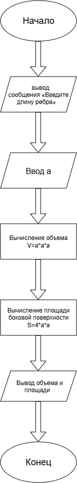

# Условие
Написать и отладить программу вычисления объема куба и площади его боковой поверхности по заданной длине ребра.
# Алгоритм 
1. Начало программы.
2. Ввод длины ребра куба "a"
3. Вычисление объема куба.
4. Вычисление площади боковой поверхности.
5. Вывод результатов.
6. Конец программы.
# Блок-схема

# Реализация
#include<stdio.h>
#include<locale.h>
int main() {
	setlocale(LC_ALL, ".UTF8");
	int a;
	printf("Введите длину ребра ");
	scanf_s("%d", &a);
	printf("Обьем куба равен %d\n", a * a * a);
	printf("Площадь боковой поверхности равна %d\n",4 * a * a);
	return 0;
}
# Результат работы 
Введите а
a=5
Обьем куба равен 125
Площадь боковой поверхности равна 100
# Информация о разработчике 
Баранов Игорь бОТИ-262
